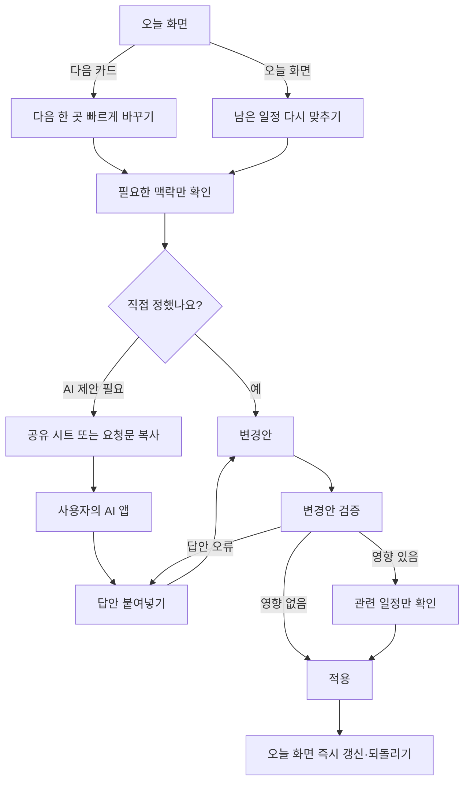

# 데이트 계획부터 추억까지의 제품 흐름

검토 기준: **2026-10-01 · T01–T06 누적 구현**. 승인된 decisions v3와
[AI 흐름 계약](ai-flow-contract.md), [수용 기준](ai-flow-acceptance.md)이 현재 동작의
권위다. 초기 논의에서 남긴 ‘제안/미결정’은 아래 누적 상태와 계약이 우선한다.
실서비스 경로는 비활성이고 실제 AI·OS 공유·모바일 실기기 검증은 남는다.
**T07 대본과 녹화 없는 실제 리허설을 수행했다. 제품 전체 완료는 메인 검토 후 판단한다.**
한 workflow의 [60초 대본](demo-video-script.md)과 [실제 실행 근거](demo-rehearsal.md)를
확인한다. 수제 AI 답안과 live LLM 검증을 구분하며 영상 제작·게시를 수행하지 않았다.

실제 사용 맥락과 후속 기능은 [조사](date-context-research.md), 구현 경로는
[구현 계획](implementation-plan.md), 실제 확인/한계는 [release readiness](release-readiness.md)와
[최종 UI audit](ui-audit.md)에 연결한다. 자동 route fixture와 실제 공개 서비스는 구분한다.

## 누적 구현 상태

- 계획: 필요한 정보와 기본 추천 하나부터 논의하고 승인/거절/다른 제안에 반응하도록
  요청한다. 승인 답안의 결과와 가져오기 안내를 붙여넣고 미리 본 뒤 저장한다.
  시각·날짜 미정, 명시적 순서와 보호 필드를 보존하며 작성 중 요청/답안은 재실행 뒤 복원된다.
- 데이트 중: 사용자가 정한 다음 활동과 최신 수동 상황을 요청에 연결한다. 동의한 경우에만
  새 요청마다 one-shot GPS를 사용하고 실패/거부/오래됨을 표시한다. 정확 좌표는 AI/보관 파일에
  넣지 않는다. 기본 공개 provider/resolver는 운영 조건 미충족으로 disabled다.
- 후보는 선택 일정과 별개다. 보호 예약은 AI가 변경/해제할 수 없다. 변경 영향은 현재 위치부터
  다음 활동과 뒤의 보호 예약까지 검사한다. verified만 검토 후 적용하며 impossible/unverified는
  검증 가능한 다른 후보 또는 기존 유지로 이어진다. 경로 영향 없는 메모·동일 장소 미정 순열은 별도다.
- 전체 일정의 실제 drag, 위/아래 버튼, 화살표 키, undo를 제공한다. 순서/시각 검토도 같은
  보호·동선·revision/context/TTL 경계를 재검사한다. 저장된 순서는 Today/AI/보관 파일에서 일치한다.
- 이후: 계획이나 GPS로 방문·감정을 추정하지 않는다. 날짜/시각 없는 독립 기록과 원문을 보존하고,
  AI 수정 문장은 별도로 확인해 저장한다. 공유 텍스트의 선택은 원본 보관본을 바꾸지 않는다.
- 실제 Chrome UI와 최신 생산 빌드의 서버 중단 재실행/직접 저장/후기 보존은 확인했다.
  파일 회수/OS 공유/실기기 touch·PWA·보조기술은 미검증이다. UI audit는15/20, 열린 P2 네 개다.

## 목표와 경계

DatePack은 데이트 전에는 큰 그림을 잡고, 데이트 중에는 상황에 맞게 바꾸며,
데이트 이후에는 함께한 시간을 기억하고 공유하도록 돕는다. 세 단계는 같은
데이트를 다루지만, 계획한 내용과 실제 있었던 일을 구분한다.

데이트 중 가장 먼저 줄여야 할 것은 계획 변경에 드는 시간과 인지 부담이다.
매 일정마다 앱을 열거나 완료를 표시해야 다음 행동을 할 수 있게 만들지 않는다.
활동 하나만 정하거나 대략적인 순서만 있는 계획도 정상적인 계획이다. 오후 세 시간,
퇴근 후 커피 한 잔, 종료 시각을 정하지 않은 만남도 포함한다. 오전·오후·저녁이나
식사·카페는 가능한 예시이며 채워야 할 칸이 아니다. 모든 시간대를 채우거나 모든
순간을 기록하는 것이 목표는 아니다.

기준 단위는 하루 전체가 아니라 **이번에 함께할 약속**이다. 각자 만남 장소까지 오는
이동, 만난 뒤의 공동 활동, 헤어진 뒤의 개인 이동을 구분한다. 앱을 열지 않은 사이에
사용자가 내린 결정과 실제 경험도 존중하며, 앱의 계획을 현실보다 우선하지 않는다.

핵심 기능은 오픈소스 앱에서 계정, DatePack의 AI 서버, 유료 API 없이 사용할 수
있어야 한다. 앱은 맥락을 정리하고 변경안을 검증·적용한다. 새로운 장소나 동선의
제안이 필요할 때에는 사용자가 자신의 AI 앱에 요청을 직접 보낸다. 향후 유료
서비스를 검토하더라도 이 기본 흐름을 대신하지 않는다.

## 전체 흐름과 단계별 결과물

| 단계        | 필요한 이유                                          | 사용자가 끝냈을 때 얻는 것                                |
| ----------- | ---------------------------------------------------- | --------------------------------------------------------- |
| 데이트 계획 | 미리 큰 그림을 잡아 당일 결정 부담을 줄인다          | 핵심 장소·약속과 비워 둔 시간이 있는 계획                 |
| 데이트 중   | 휴무, 혼잡도, 취향, 컨디션 등 현실의 변수에 대응한다 | 지금 상황에 맞는 다음 행동과 필요한 만큼 수정한 남은 계획 |
| 데이트 이후 | 함께한 시간을 기억하고, 공유하고, 돌아본다           | 실제 경험을 바탕으로 사용자가 남기기로 한 기록            |

AI 요청문과 결과물 형식은 이 흐름을 지원하도록 설계한다. 먼저 각 단계에서
사용자가 어떤 결정을 내리고 무엇을 얻는지 정한 뒤, AI와 논의할 과정과 앱으로
돌아올 결과물을 정의한다. 화면 구성이나 JSON 형식부터 확정하지 않는다.

### 단계 사이에 이어지는 정보 — 제안

- **계획 → 데이트 중:** 선택한 핵심 장소, 확정 약속, 대략적인 순서·시간대,
  선호와 제약을 가져온다. 빈 시간은 미완성으로 취급하지 않는다.
- **데이트 중 → 이후:** 수정된 계획만으로 방문 기록을 만들지 않는다. 사용자가
  확인한 방문·건너뜀과 남겨 둔 사진·메모를 바탕으로, 기억나는 내용을 보완한다.
- 데이트 중 앱을 한 번도 열지 않았어도 이후 기록을 시작할 수 있어야 한다.
  계획을 실제 경험으로 확인하거나 고칠 수 있고, 기억나지 않는 부분은 비워 둔다.
- 날짜가 지났다는 이유만으로 계획을 완료 처리하거나 회고 작성을 강요하지 않는다.

### 먼저 구분할 개념 — 제안

아래 계획·기록 외에 **현재 맥락**이 필요하다. 사용자가 마지막으로 알려 준 장소,
현재 하는 일, 이미 정한 다음 목적지와 그 기준 시점이다. 계획에 없는 장소도 가능하며,
이를 입력했다고 과거의 방문·건너뜀이 자동 확정되는 것은 아니다.

| 개념           | 의미                                           | 변경할 때의 기본 방향                                      |
| -------------- | ---------------------------------------------- | ---------------------------------------------------------- |
| 핵심 장소·활동 | 이번 데이트에서 우선적으로 하고 싶은 것        | 가능한 한 살리되, 사용자의 의사에 따라 교체할 수 있다      |
| 확정 약속      | 예약처럼 시간·장소 등 지켜야 할 조건이 있는 것 | 보호할 조건을 명확히 하고 사용자 확인 없이 변경하지 않는다 |
| 후보           | 아직 선택하지 않은 대안                        | 실제 일정이나 방문 기록에 자동으로 포함하지 않는다         |
| 현재 계획      | 앞으로 하려는 일                               | 현실에 맞게 수정할 수 있다                                 |
| 실제 기록      | 사용자가 실제로 했다고 확인한 일               | 재계획이나 AI 제안으로 덮어쓰지 않는다                     |

여기서 핵심 장소를 미리 ‘정한다’는 것과 변경을 금지한다는 것은 구분한다.
예를 들어 오후 전시 관람은 핵심 활동일 수 있고, 18시 식당 예약은 확정 약속일 수
있다. 장소 전체를 보호할지, 시간이나 활동만 보호할지는 아직 결정하지 않았다.

## 1. 데이트 계획 — 제안

### 목적

사용자가 이번 약속에서 참고할 큰 그림을 만든다. 함께할 수 있는 범위 안에서
원하는 활동을 필요한 만큼 고르고, 나머지는 현장에서 결정할 수 있게 남긴다.
한 장소만 정해도 유효하며, 활동 분류나 분 단위 일정표를 완성해야만 시작할 수
있게 하지 않는다. 정확한 시각, 대략적인 범위, 순서만 정한 활동을 구분한다.

### 흐름

1. 사용자가 이미 정한 내용을 가져온다. 직접 적거나 기존 파일을 열 수 있고,
   새로운 제안이 필요하면 AI와 논의할 요청을 만든다.
2. 날짜·지역·대략적인 가용 시간, 가고 싶은 곳, 확정 약속, 선호·제약 중 다음
   결정을 내리는 데 필요한 것만 확인한다. 필수 입력의 정확한 범위는 미결정이다.
3. AI가 필요한 경우, 부족한 맥락을 필요한 만큼 물어보고 핵심 장소와 대안을
   논의하도록 요청한다. 처음부터 하루 전체를 채운 최종 답안을 강요하지 않는다.
4. 사용자가 선택한 결과를 앱으로 가져온다. 선택한 장소와 후보, 확정 약속을
   구분하고 시간·이동의 무리와 확인이 필요한 정보를 보여준다. AI의 장소 정보나
   영업 여부를 앱이 검증한 사실로 표시하지 않는다.
5. 사용자가 계획을 저장한다. 빈 시간과 미정인 선택이 남아 있어도 사용할 수 있다.
   계획은 이후 당일 변경의 기준이 된다.

### 이 단계에서 남길 결과

선택한 핵심 장소·활동, 확정 약속, 대략적인 순서·시간대, 필요한 제약이다.
후보와 선택 이유를 얼마나 보존할지, 계획을 상대와 어떻게 공유하고 함께 정할지는
미결정이다. 공동 편집이나 계정 기반 동기화를 기본 전제로 삼지 않는다.

### 각자 출발하고 합류하는 흐름 — 제안

1. 함께 공유할 만남 장소·시각 또는 범위·구체적인 합류 지점을 정한다. 역에서 먼저
   만나는 경우 그 지점은 첫 식당과 다를 수 있다.
2. 각자의 출발지·수단·이동 예상은 필요한 사람만 입력하거나 지도 앱에서 확인한다.
   집 주소나 실시간 위치를 공유해야 계획을 쓸 수 있게 만들지 않는다.
3. 출발 안내는 개인 이동 맥락을 기준으로 한다. 두 사람이 서로 다른 곳에서 오는데
   한 개의 이동 시간이나 출발 시각을 공통으로 안내하지 않는다. 정보가 없으면 모르는
   상태로 두며, 현재 지도 연결을 경로 계산 기능처럼 설명하지 않는다.
4. 한 사람의 지연이 확인되면 합류와 관련 약속의 영향만 확인한다. 모든 일정을 자동으로
   늦추지 않는다. 만난 후에는 공동 활동을, 헤어진 뒤에는 각자의 귀가를 구분한다.

## 2. 데이트 중

### 목적과 사용 상황

휴무, 예상과 다른 혼잡도나 분위기, 선호 변경, 컨디션, 예상 밖의 방문 등으로
계획이 달라진다. 한 곳만 교체할 수도 있고, 핵심 약속을 제외한 나머지를 즉흥적으로
다시 정할 수도 있다. 목표는 원래 계획을 끝까지 수행하게 하는 것이 아니라,
함께 있는 시간을 덜 방해하면서 다음 행동을 결정하도록 돕는 것이다.

- 사용자는 식당이나 카페처럼 여유가 생겼을 때 앱을 여는 편이다. 짐을 들고
  이동할 때에는 열지 않을 수 있다.
- 산책 중에도 다음 장소가 마음에 들지 않으면 짧게 대안을 찾고 싶을 수 있다.
- 컨디션, 갑자기 가고 싶은 활동, 이미 방문한 곳 주변의 동선 때문에 계획이 바뀐다.
- 앱을 다시 열었을 때 이미 지난 일정이 미체크 상태일 수 있다. 미체크는
  ‘하지 않았다’와 같지 않다.
- 앱을 보지 않고 두 사람이 다음 장소를 정하거나 이미 다른 곳으로 이동할 수 있다.
  앱을 다시 여는 목적이 새 제안을 받는 것이라고 가정하지 않는다.

### 흐름 0 · 앱 밖에서 바뀐 현재 상황 반영 — 제안

다시 열었을 때 기존 계획이 맞지 않으면 ‘지금 상황 맞추기’로 현재 장소·하고 있는 일·
이미 정한 다음 목적지 중 필요한 것만 반영한다. 매번 복귀 질문을 강제로 띄우지는 않는다.

1. 이미 카페에 왔다면 그 장소를 현재 맥락으로 삼는다. 예정에 없던 방문도 허용한다.
2. 다음 곳도 직접 정했다면 그 선택을 반영한다. 아직 선택하지 않은 경우에만 아래의
   다음 한 곳 변경 또는 남은 일정 조정 흐름으로 이어진다. AI는 필수가 아니다.
3. 이전 일정은 방문·미방문을 추정하지 않는다. 현재부터의 남은 계획과 충돌만 확인한다.
   예정 시각이 지났어도 아직 하고 싶은 활동은 사용자가 남은 계획으로 가져올 수 있다.
4. 사용자가 확인한 이미 일어난 일은 실제 기록에, 앞으로 하려는 일은 계획에 반영한다.
   모든 과거 기록을 복구해야 계속 사용할 수 있게 하지 않는다.

예: 계획은 ‘식당 → 전시 → 카페’였지만 전시를 갔는지 앱은 모르는 상태에서 사용자가
“이미 다른 카페에 와 있고, 다음에는 근처 서점에 가기로 했어요”라고 알린다. 앱은
현재 카페와 다음 서점을 반영하고, 이전 식당·전시 방문 여부는 미확인으로 남긴다.

### 공통 변경 원칙

1. **기준점은 지금의 현실이다.** 현재 시각을 기본값으로 쓰되, 사용자가 대략적인
   과거 시각으로 바꿀 수 있다. 현재 장소는 선택 입력이며 마지막 확인 시점을 함께
   다룬다. 과거의 미체크 일정을 완료로 추정하지 않는다. 기본적으로 과거 계획을
   건드리지 않되, 사용자가 아직 할 일로 선택하면 남은 계획에 포함할 수 있다.
2. **변경 범위는 진입점이 정한다.** 다음 카드에서 들어오면 ‘다음 한 곳’을,
   오늘 화면의 전체 변경 행동에서 들어오면 ‘남은 일정’을 기본 범위로 한다.
3. **영향이 없으면 더 묻지 않는다.** 다음 장소를 바꿔도 뒤의 약속에 무리가
   없으면 바로 적용한다. 영향이 있을 때에만 관련 일정과 선택지를 보여준다.
4. **확정된 약속은 앱이 보호한다.** AI 요청문에 고정 일정을 적는 데 그치지 않고,
   변경안을 적용할 때에도 검사한다. 사용자가 직접 해제한 경우에만 바꾼다.
5. **계획과 실제 기록을 혼동하지 않는다.** 과거의 미체크 일정을 임의로 완료
   처리하거나, 원래 계획을 지워서 실제 방문 기록인 것처럼 만들지 않는다.

6. **AI 앱을 다녀와도 작업을 이어간다.** 변경 범위, 기준점, 입력한 상황과 요청문을
   기기에 임시 저장한다. 사용자가 돌아오면 같은 단계에서 답안을 붙여넣는다.

### 제안하는 당일 흐름

아래는 앞으로의 선택을 바꾸려는 경우의 흐름이다. 앱 밖에서 이미 결정했거나
일어난 일을 반영하려는 경우에는 위의 ‘현재 상황 반영’에서 시작한다.

‘다음 한 곳’과 ‘남은 일정’은 별도 범위 선택 화면이 아니라 진입한 행동으로
정해진다. AI를 거치지 않아도 변경안을 만들 수 있으며, 영향이 없으면
관련 없는 일정까지 검토하게 하지 않는다.

### 흐름 A · 이동 중 다음 한 곳 바꾸기

진입점은 오늘 화면의 **다음 일정 카드 → 다음 장소 바꾸기**다. 짧은 흐름을
우선하며, 현재 산책을 완료로 표시할 필요가 없다.

1. 사용자는 지도에서 고른 장소를 입력하거나, ‘가까운 다른 곳’, ‘실내’,
   ‘조용한 곳’ 같은 짧은 조건으로 AI 대안을 요청한다.
2. AI가 필요하면 앱이 현재 위치 또는 사용자가 적은 기준 장소, 다음 일정,
   뒤의 고정 약속을 넣어 요청문을 만든다. 사용자는 모바일 공유 시트의 AI 앱을
   선택하거나 요청문을 복사해 자신의 AI에 보낸다.
3. 사용자가 장소를 고르면 앱은 **다음 일정과 그 뒤의 확정 일정**에 미치는
   영향만 확인한다. 영향이 없으면 바로 적용한다. 있으면 관련 일정만 비교해
   보여주고 사용자가 조정한다.
4. 적용 후 오늘 화면은 바뀐 다음 장소를 즉시 보여주며, 되돌리기를 제공한다.

### 흐름 B · 여유 있는 장소에서 함께할 남은 일정 다시 맞추기

진입점은 오늘 화면의 **남은 일정 다시 맞추기**다. 식당이나 카페에서 앱을
다시 열어도 앞선 모든 일정을 확인하도록 요구하지 않는다.

1. 앱은 ‘지금부터’를 기준으로 삼는다. 사용자는 필요하면 ‘조금 전부터’로
   바꾸고 현재 장소와 상황을 한 문장으로 적는다. 예: “피곤해서 이동을 줄이고,
   이 식당 근처에서 노래방에 가고 싶어요.”
2. 사용자는 **기존 계획 조정**과 **남은 일정 새로 제안받기** 중 하나를 고른다.
   이번 약속이 오후에 끝나면 그 이후의 저녁 일정은 제안하지 않는다. 식사나 카페,
   예약이 없는 계획도 정상으로 다룬다.
   조정은 기존의 가능한 일정을 살린다. 새 제안은 이미 지난 부분과 고정 약속을
   보존한 채 남은 유동적인 부분을 다시 구성한다. 빈 시간을 억지로 채우지 않는다.
3. 앱은 AI 요청문을 만들어 사용자가 선택한 AI 앱으로 공유한다. 공유가
   불가능하거나 원하는 AI가 목록에 없으면 복사를 제공한다.
4. 사용자가 답안을 붙여넣으면 앱은 **유지·이동·교체·삭제·추가**를 사람의
   언어로 보여준다. 시간 충돌, 이동 가능성, 고정 일정 변경 여부를 실제 적용할
   변경안에 대해 검사한다. 장소의 영업 여부와 실시간 이동 시간은 앱이 확인한
   사실처럼 표시하지 않는다.
5. 사용자가 적용하면 오늘 화면으로 돌아가 변경된 현재·다음을 보여준다.
   결과를 되돌릴 수 있고, 원래 계획과 이미 일어난 일은 보존한다.

### 당일 흐름 규칙의 구현 기준

- **지금 진행 중인 일정:** 예정 시각이 지난 일정과 실제로 끝난 일정을 어떻게
  구분할지 정한다. 과거 기준점을 선택해도 실제 완료 기록은 보호해야 한다.
- **이동 정보를 모르는 경우:** ‘영향 없음’과 ‘판단할 정보 부족’을 구분한다.
  고정 약속뿐 아니라 사이에 있는 유동 일정에 미치는 영향도 검사해야 한다.
- **오래된 답안:** AI 요청 후 시간이 흐르거나 계획이 수정되었을 때 재검증한다.
  다른 계획의 답안이나 같은 답안의 중복 적용도 구분할 수 있어야 한다.
- **직접 조정:** AI 없이 남은 일정의 장소·시간을 바꾸거나 제외하는 흐름과,
  오프라인에서 가능한 범위를 정한다. 흐름 B의 AI 요청은 선택 경로가 되어야 한다.
- **적용 시점:** 직접 고른 장소의 변경 확정과 AI 답안 붙여넣기를 구분한다.
  ‘추가 질문 없이 적용’이 AI 결과의 사용자 확인까지 생략하는 뜻인지 명확히 한다.
- **당일 기록:** 완료 체크를 강요하지 않으면서 자발적으로 남길 수 있는 정보와,
  이후 보완할 정보를 정한다. 재계획은 실제 기록을 만들어내는 행동이 아니다.

## 3. 데이트 이후 — 제안

### 목적

함께 갔던 곳과 기억에 남는 순간을 돌아보고 기념으로 남기거나 공유한다.
계획 대비 달성률을 평가하는 단계로 만들지 않는다. 다음 데이트에 참고할 취향이나
후기는 확장 가능한 목적이며, 첫 결과물의 중심으로 삼을지는 아직 정하지 않았다.

### 흐름

1. 사용자가 해당 데이트를 다시 열어 기록을 남기기로 선택한다.
2. 실제로 방문한 곳과 계획에만 있던 곳을 구분한다. 계획에 없던 방문도 추가할 수
   있고, 미체크 일정을 전부 처리하거나 정확한 시간을 복원하도록 요구하지 않는다.
3. 남기고 싶은 사진과 짧은 메모를 선택한다. 최소 결과물은 장소·사진·메모를 모은
   기록으로 제안하되, 공유용 요약과 후기 중 무엇을 우선할지는 논의한다.
4. 글 정리가 필요하면 선택한 실제 기록으로 AI에 요청한다. AI는 제공된 사실을
   정리하고 필요한 부분을 질문할 수 있지만, 방문·대화·감정을 지어내지 않는다.
   AI 없이도 기록을 저장할 수 있어야 한다.
5. 사용자가 내용을 확인해 저장하고, 원하면 공유할 내용만 선택한다. 개인 보관본과
   공유할 범위를 구분하며, 공유용 파일·이미지·링크 중 제공할 형식은 미결정이다.

### 이 단계에서 남길 결과

사용자가 실제 경험으로 확인한 기록과 선택한 사진·메모다. 원래 계획, 수정된 계획,
실제 기록을 어디까지 함께 보관할지 정해야 한다. 이후 기록을 고치거나 파일을
다시 열어도 어떤 정보가 보존되어야 하는지까지 정의한다.

## 단계별 AI 요청과 결과물

| 단계      | AI와 논의할 과정                                      | 앱으로 가져올 결과                   | 앱의 책임                                                  |
| --------- | ----------------------------------------------------- | ------------------------------------ | ---------------------------------------------------------- |
| 계획      | 필요한 조건을 확인하고 핵심 장소·동선을 제안·선택한다 | 사용자가 선택한 느슨한 계획          | 계획 구조와 제약을 검사하고 후보·확정 약속·미정을 구분한다 |
| 데이트 중 | 지금 상황에서 바꿀 범위를 정하고 대안을 선택한다      | 선택한 범위에 대한 변경안            | 현재 계획에 대조해 검증하고 보호 대상과 실제 기록을 지킨다 |
| 이후      | 사용자가 제공한 기억을 정리하고 표현을 다듬는다       | 실제 기록에 근거한 글 또는 요약 초안 | 사용자 확인 후 저장하고 공유 범위를 분리한다               |

AI와의 대화 과정과 앱이 읽을 최종 결과는 구분한다. 대화 중간마다 형식에 맞춘
답안을 내게 하기보다, 사용자가 내용을 선택한 뒤 가져올 결과를 만들도록 요청한다.
요청문은 목적, 알려진 정보, 물어볼 정보, 바꾸면 안 되는 것, 불확실한 정보의 처리,
최종 결과물 조건을 담는다. 구체적인 질문 수와 결과 형식은 실제 사례로 검증한다.

사진은 AI 요청에 자동 첨부하지 않는다. 기록에 사진을 보관하는 것과 외부 AI에
보내는 것은 별도 선택이다. 각 단계에서 공유할 맥락을 사용자가 확인할 수 있어야 한다.

### 모바일 AI 전달

웹 공유 기능이 있는 환경에서는 사용자의 버튼 동작으로 [공유 시트](https://developer.mozilla.org/en-US/docs/Web/API/Web_Share_API)를 열어
요청문 텍스트를 전달하는 방식을 우선 검토한다. **특정 AI 앱이 공유 대상으로
항상 나타나거나 자동으로 선택된다고 가정하지 않는다.** 공유 시트가 없거나
원하는 앱이 없으면 ‘요청문 복사’를 제공한다. AI 답안을 DatePack으로 다시
가져오는 단계는 붙여넣기를 기본으로 설계한다. 기기별 실제 동작은 iOS와
Android에서 검증해야 한다.

공유 전에 어떤 일정·장소·제약이 요청문에 들어가는지 사용자가 볼 수 있어야
한다. DatePack은 자동으로 외부 AI에 데이터를 보내지 않는다.

공유 시트는 특정 앱을 자동 선택하는 기능이 아니다. iPhone과 Android에서
ChatGPT·Gemini·Claude가 공유 대상으로 나타나는지, 요청문 텍스트가 온전히
전달되는지 확인한다. 어떤 앱이 목록에 없거나 텍스트를 받지 못하면 복사한
요청문을 그 앱에 직접 붙여넣는 경로를 사용한다.

실기기 확인 범위는 iPhone의 Safari·홈 화면 앱, Android의 Chrome·설치한 앱과
각 환경의 ChatGPT·Gemini·Claude다. 대상 앱 노출 여부, 긴 요청문 전달,
DatePack 복귀 후 작성 상태, 답안 복사·붙여넣기를 확인한다. 검증 전에는
특정 앱으로 한 번에 연결된다고 제품 문구에 약속하지 않는다.

## 당일 변경안의 판단 규칙

| 상황                                   | 기본 처리                                                      |
| -------------------------------------- | -------------------------------------------------------------- |
| 다음 장소 변경이 뒤의 약속에 영향 없음 | 다음 일정만 바꾸고 끝낸다                                      |
| 다음 장소 변경이 고정 약속과 충돌      | 충돌 원인을 보여주고 사용자가 다음 장소나 약속 변경을 선택한다 |
| 느슨한 계획의 빈 시간                  | 채워야 할 오류로 취급하지 않는다                               |
| 과거 일정이 미체크 상태                | 완료·건너뜀을 추측하지 않고 재계획 범위에서 보호한다           |
| AI 답안이 잘못됐거나 일부만 적용 가능  | 기존 계획을 유지하고 문제와 다시 요청할 문구를 보여준다        |
| 새 장소의 영업 여부가 불확실           | 지도에서 확인할 수 있게 표시한다                               |

## 누적 구현과 검증 경계

정확한 시작 시각 강제, ID 중심 패치의 새 장소/미정 표현 부족, 초안 창 닫힘/입력 소실,
보호 해제 안내와 범위 불일치, 직접 순서 조작 부재는 T01–T05에서 보완했다.
T06은 이를 다시 적용하지 않고 통합 동선·저장·복귀·privacy와 UI를 확인했다.
서비스 fixture의 route A/B/C는 자동 검사이며 실제 카페/예약 도착 성공은 아니다.
실서비스 GPS 지역 조회/도보·대중교통 운영 조건, 실기기 공유/설치/파일 왕복, held pointercancel은
남은 확인이다. 진행 중 요청의 범위 표시/취소→새 요청 안내, 작은 보조 hit area와 초기 bundle은
[UI audit](ui-audit.md)의 P2 후속 항목이다.

## 전체 흐름의 첫 검증 사례

### 계획

1. 오전 전시와 저녁 예약만 정하고 나머지는 비워 둔다. 정확한 시각이 없는 활동을
   임의의 시각으로 바꾸거나 빈 시간을 채우지 않고 계획을 저장할 수 있어야 한다.
2. 가고 싶은 카페는 핵심 장소지만 예약은 아니다. 당일 휴무가 확인되면 교체할 수
   있고, 별개의 저녁 예약은 보호되어야 한다.

### 데이트 중

1. 산책 중 다음 카페가 마음에 들지 않아 다른 곳으로 바꾼다. 뒤의 저녁 예약에
   영향이 없으면 추가 질문 없이 오늘 화면으로 돌아온다.
2. 식당에서 쉬다가 컨디션 때문에 가까운 노래방을 넣고 싶어진다. 사용자는 지난
   미체크 일정을 일일이 처리하지 않고 남은 일정 제안을 받아 적용한다.
3. 점심과 오후 카페 사이에 여유가 큰 계획에서 예상 밖의 장소를 방문한다.
   영향받는 일정이 없으면 억지로 하루 전체를 재생성하지 않는다.
4. AI 답안이 고정 예약을 삭제하거나 잘못된 일정 ID를 사용한다. 앱은 이를
   적용하지 않고 사용자가 수정 또는 재요청할 수 있게 설명한다.

5. 사용자가 요청문을 AI 앱에 보낸 뒤 DatePack을 다시 연다. 작성하던 변경이
   그대로 남아 있고 답안 붙여넣기부터 이어진다.
6. AI 답안을 가져오기 전에 시간이 지나거나 계획을 직접 수정했다. 예전 요청을
   그대로 적용하지 않고 달라진 조건을 확인할 수 있어야 한다.
7. 현재 위치나 이동 시간을 모른다. 앱은 이를 ‘충돌 없음’이라고 단정하지 않는다.
8. 인터넷이 없거나 AI를 쓰지 않는다. 직접 선택한 장소로 바꾸고 저장할 수 있다.

### 데이트 이후

1. 당일 앱을 거의 열지 않았다. 실제로 갔던 곳만 확인하고 사진과 한 줄 메모를
   남길 수 있으며, 기억나지 않는 시각이나 미방문 여부를 전부 채울 필요가 없다.
2. 계획에 없던 장소에서 좋은 시간을 보냈다. 실제 기록에 추가할 수 있고, 원래
   계획에 있었다고 바꾸지 않는다.
3. AI에 기록 정리를 요청한다. 미확인 방문이나 감정을 만들어내지 않고 사용자가
   결과를 확인한 뒤 저장한다.
4. 공유할 기록에서 개인 메모나 사진 일부를 제외한다. 개인 보관본은 유지된다.

검증에서는 세 단계 모두 실제 사용자 사례를 사용한다. 계획의 빈 시간을 미완성으로
느끼지 않는지, 당일 변경에 걸린 시간·입력·앱 전환이 감당할 만한지, 이후 결과물을
실제로 보관하거나 공유하고 싶은지 확인한다. 성공 기준의 구체적인 수치는 미결정이다.

## 후속 확장 논의의 확인 목록

1. **계획의 최소 단위:** 장소·활동·시간대 중 무엇만 있어도 유효한 일정인가?
   날짜 미정이나 장소 하나만 정한 상태에서 시작할 수 있는가?
2. **핵심과 확정의 구분:** 핵심 장소, 예약, 후보를 어떻게 구분하며 무엇을 보호하는가?
3. **당일 현실의 확인:** 진행 중·지난 일정·미확인 상태와 이동 정보 부족을 어떻게 다루는가?
4. **기록과 보존:** 당일 최소 기록, 이후 보완, 원래 계획 보존, 되돌리기와 파일 내보내기의
   범위는 어디까지인가?
5. **이후 결과물과 공유:** 추억 기록, 공유용 요약, 다음 데이트 참고 중 첫 결과물의
   중심은 무엇인가? 상대는 앱 없이 볼 수 있어야 하는가?
6. **AI와 앱의 분담:** 각 단계의 직접 작업 경로와 AI 논의 경로가 각각 어디서 끝나고,
   어떤 결과를 사용자 확인 후 저장하는가?

## 설계와 구현 순서 — 초기 계획 기록

1. 같은 데이트의 계획·당일 변경·이후 기록 사례를 끝까지 써 보고, 위 미결정 사항 중
   데이터와 사용자 행동에 영향을 주는 규칙을 합의한다.
2. 느슨한 계획, 보호할 약속, 실제 기록, 변경안의 최소 형식과 저장·파일 호환 범위를
   정한다. 프롬프트가 반환할 형식도 이 결정에 맞춘다.
3. 지난 날짜의 상태 표시와 변경안 미리보기·적용 검사를 바로잡고, AI 없이도 계획을
   만들고 바꾸고 기록할 수 있는 최소 흐름을 잇는다.
4. 각 단계의 AI 요청과 결과 가져오기를 연결한다. 모바일 공유·복사 대안·임시 저장·
   복귀·재검증을 실제 기기에서 확인한다.
5. 한 데이트가 세 단계를 통과하는지 검증하고, 이후 결과물의 보관·공유 경험을 확인한다.
